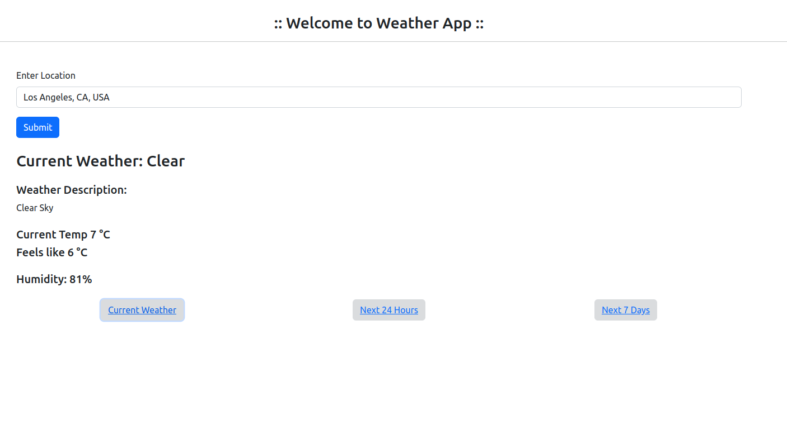

# Open-weather Api

Latest Laravel Project with Open Weather API to provide users with current weather information, hourly forecasts for the next 24 hours, and daily forecasts for the next 7 days based on their selected location.


## Features

- Current weather conditions as per the Open Weather API.
- Hourly weather forecast for the next 24 hours.
- Daily weather forecast for the next 7 days.
- Location selection via Google Places Autocomplete.

## Installation

Install bellow commands.

```bash
  git clone https://github.com/hupptechnologies/open-weather-api.git
  cd open-weather-api
  cp .env.example .env
  Set OPENWEATHER_API_URL, OPENWEATHER_API_KEY and GOOGLE_MAPS_API_KEY parameters in .env file
  docker compose up -d
  docker-compose exec app composer install
  docker-compose exec app php artisan key:generate

  check Application on http://localhost
```
## Screenshots

